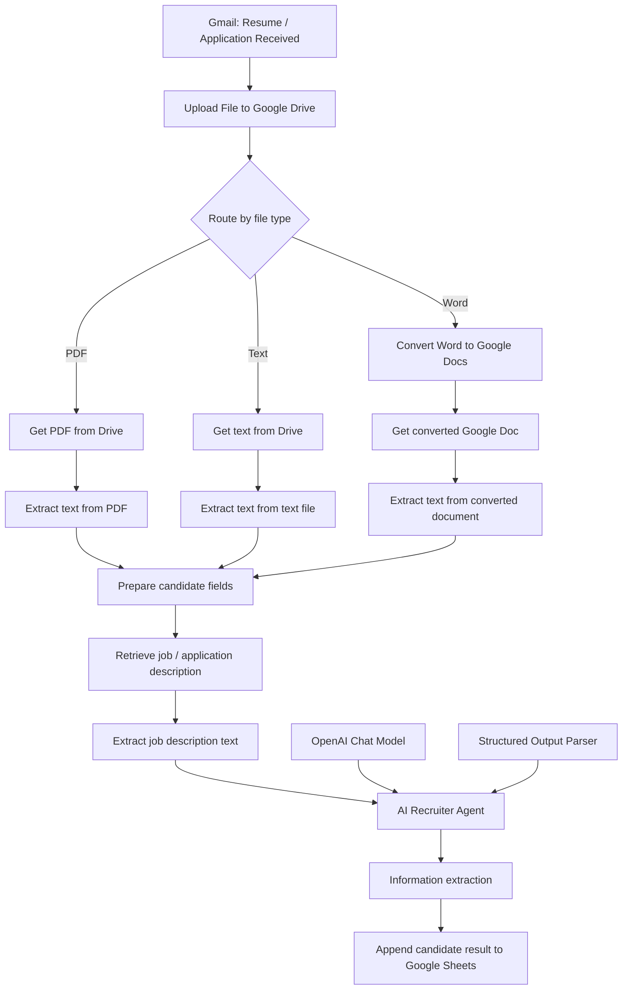

# System Organogram

```mermaid
flowchart TD
    A[Gmail: Resume / Application Received] --> B[Upload File to Google Drive]
    B --> C{Route by file type}
    C -->|PDF| D[Get PDF from Drive]
    D --> E[Extract text from PDF]
    C -->|Text| F[Get text from Drive]
    F --> G[Extract text from text file]
    C -->|Word| H[Convert Word to Google Docs]
    H --> I[Get converted Google Doc]
    I --> J[Extract text from converted document]
    E --> K[Prepare candidate fields]
    G --> K
    J --> K
    K --> L[Retrieve job / application description]
    L --> M[Extract job description text]
    M --> N[AI Recruiter Agent]
    O[OpenAI Chat Model] --> N
    P[Structured Output Parser] --> N
    N --> Q[Information extraction]
    Q --> R[Append candidate result to Google Sheets]
```

*Diagram reflects the supplied screenshot; confirm exact execution wiring and node settings against the exported workflow.*
